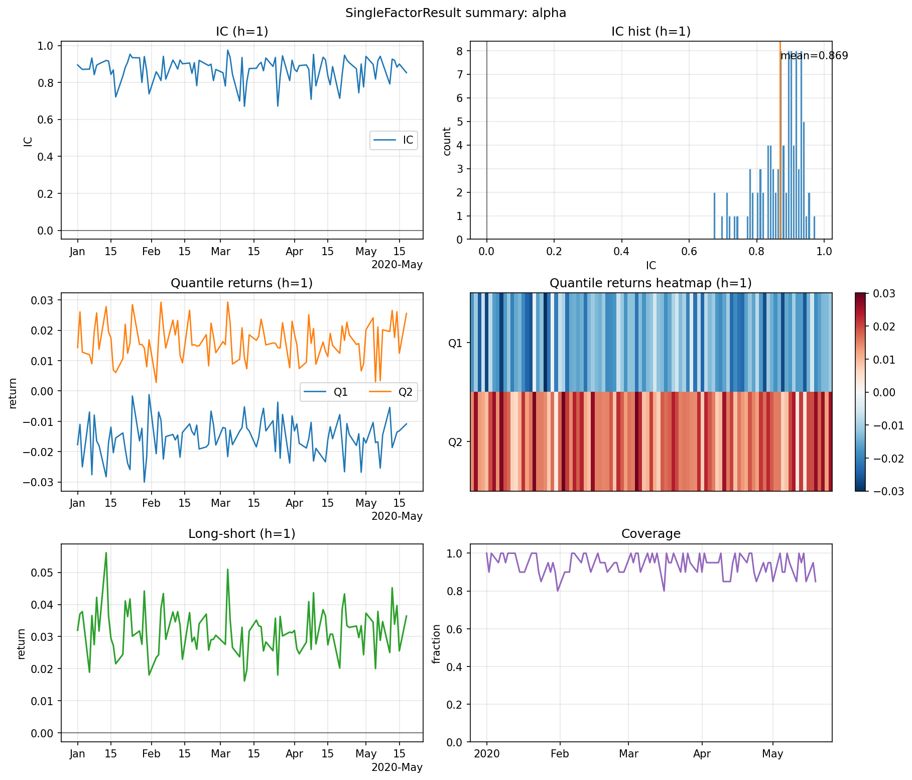
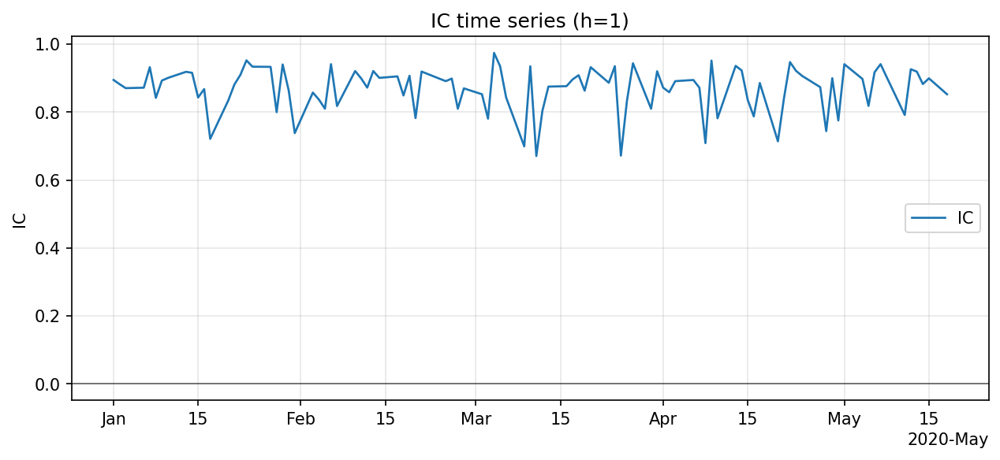
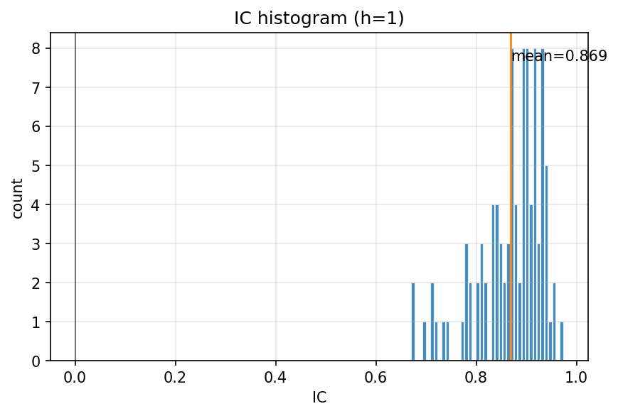
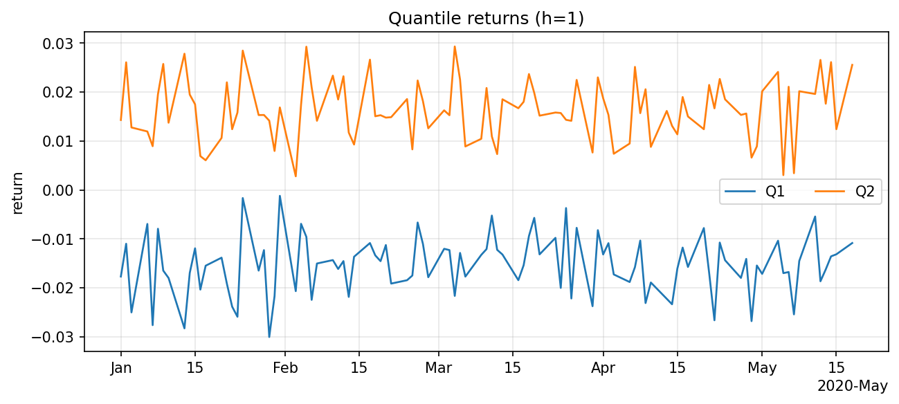
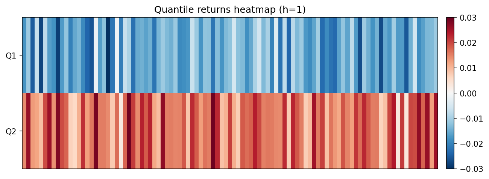
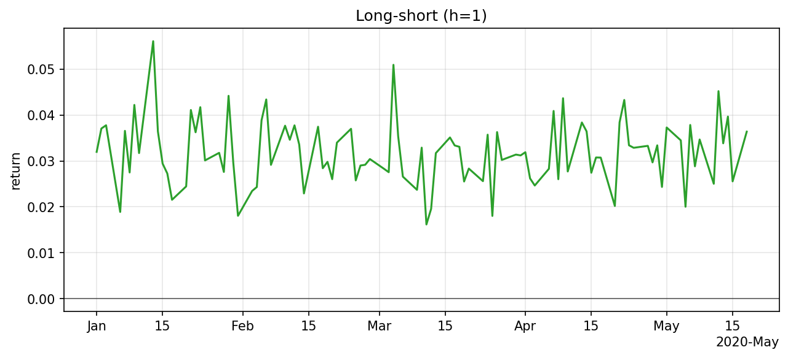

# Getting started (single-factor evaluation)

`bagel-factor` is a small, pandas-first toolkit for **single-factor evaluation/testing**.

## Overall workflow

1. **Prepare a canonical panel**: a `pd.DataFrame` indexed by `(date, asset)`.
2. **(Optional) Preprocess the factor** cross-sectionally per date (rank/z-score/clip/etc.).
3. **Compute forward returns** for one or more horizons (the job does this for you).
4. **Evaluate**:
   - IC / RankIC time series and ICIR
   - quantile returns and long-short returns
   - coverage (missingness)
   - turnover (available in the result, not shown below)
5. **Export** results to files (or keep everything in-memory).

This guide shows the concrete API calls and the exact expected outputs.
All files shown below are generated by `examples/example.py` into `./examples/`.

---

## 1) Input format: canonical panel

### What is a “panel” in this package?

A **panel** is the canonical internal representation:
- type: `pd.DataFrame`
- index: `pd.MultiIndex` with names `("date", "asset")`
- rows: one row per `(date, asset)`

Typical columns include:
- a **price** column (default: `close`) used to compute forward returns
- one or more factor columns (the signal you want to evaluate)

### Example input

The example input (saved as `examples/inputs/panel.csv`) is a deterministic synthetic dataset with:

- **100 dates** (business days)
- **20 assets** (`A00`..`A19`)

The file is too large to inline here; below is the *first few rows*:

| date       | asset | close             | alpha               |
| ---------- | ----- | ----------------- | ------------------- |
| 2020-01-01 | A00   | 104.4535218971883 | 0.9417154046806644  |
| 2020-01-01 | A01   | 103.4787772728434 | -2.1106967367366654 |
| 2020-01-01 | A02   | 105.1528305879436 | 1.5047913144086922  |
| ...        | ...   | ...               | ...                 |

### `ensure_panel_index(df) -> panel`

`ensure_panel_index` converts a “flat” DataFrame with `date` and `asset` columns into the canonical `(date, asset)` index.

```python
import pandas as pd
from bagelfactor.data import ensure_panel_index

raw = pd.read_csv("examples/inputs/panel.csv")
panel = ensure_panel_index(raw)

assert panel.index.names == ["date", "asset"]
```

---

## 2) Preprocessing (optional but common)

Preprocessing typically standardizes the factor cross-sectionally per date.
In v0, preprocessing is implemented as a simple `Pipeline` of transforms.

### `Pipeline([steps...])`

A `Pipeline` applies steps in order, returning a modified panel.

### Common transforms

#### `Clip(column, lower=None, upper=None)`

Clips a column into a fixed range.
This is commonly used to reduce the impact of extreme outliers.

#### `ZScore(column)`

Computes a cross-sectional z-score **within each date**.
This standardizes the factor to mean 0 and std 1 per date (when std is non-zero).

#### `Rank(column)`

Ranks a column **within each date** (default output is scaled to `[0, 1]`).
Ranking is common in factor research because it makes the signal scale comparable across dates.

Example (multi-step pipeline):

```python
from bagelfactor.preprocess import Clip, Pipeline, Rank, ZScore

preprocess = Pipeline([
    Clip("alpha", lower=0.0, upper=2.0),
    ZScore("alpha"),
    Rank("alpha"),
])

panel_pp = preprocess.transform(panel)
```

---

## 3) Run single-factor evaluation

### `SingleFactorJob.run(...) -> SingleFactorResult`

`SingleFactorJob.run` is the main entrypoint.
It:
- (optionally) filters by universe
- (optionally) preprocesses the factor
- computes forward returns from `price` (default `close`) for each horizon
- computes evaluation metrics

### Horizons (forward return windows)

`horizons` is a **tuple of positive integers**, measured in **number of rows/dates forward**.

Examples:
- `horizons=(1,)` means evaluate next-day returns (t+1 vs t)
- `horizons=(1, 5, 20)` means evaluate 1-day, 1-week-ish, and 1-month-ish horizons

You can pass multiple horizons at once; the result dictionaries are keyed by the horizon integer (`res.ic[1]`, `res.ic[5]`, ...).

```python
from bagelfactor.single_factor import SingleFactorJob

res = SingleFactorJob.run(
    panel,
    factor="alpha",          # the factor column name in the panel
    price="close",           # used to compute forward returns
    horizons=(1, 5, 20),       # tuple[int, ...] (multiple horizons supported)
    n_quantiles=2,            # number of buckets per date
    preprocess=preprocess,    # optional
)

# Access per-horizon outputs
ic_1d = res.ic[1]
ic_5d = res.ic[5]
qret_20d = res.quantile_returns[20]
```

### Understanding the result object

- `res.ic[h]`: per-date IC time series for horizon `h`
- `res.icir[h]`: ICIR summary for horizon `h`
- `res.quantile_returns[h]`: per-date mean forward return per quantile
- `res.long_short[h]`: per-date (top quantile − bottom quantile) returns
- `res.coverage`: fraction of non-missing factor values per date

### Plotting

```python
from bagelfactor.visualization import plot_result_summary

fig = plot_result_summary(res, horizon=1)
fig.show()
```

### Statistical tests

```python
from bagelfactor.stats import ols_alpha_tstat, ttest_1samp

# Test mean IC != 0
ic_test = ttest_1samp(res.ic[1], popmean=0.0)

# Test long-short "alpha" (intercept) != 0
ls_alpha = ols_alpha_tstat(res.long_short[1])

print(ic_test)
print(ls_alpha)
```

Example inspection:

```python
print("ICIR(h=1):", res.icir[1])
print(res.ic[1])
print(res.quantile_returns[1])
```

---

## 4) Expected outputs (generated by `examples/example.py`)

### `examples/outputs/example_stdout.txt`

```text
Wrote inputs to: examples/inputs
Wrote outputs to: examples/outputs
Wrote plots to: examples/outputs/plots
ICIR(h=1): 13.177759456489515
IC(h=1) head:
date
2020-01-01    0.894737
2020-01-02    0.882353
2020-01-03    0.870677
2020-01-06    0.871930
2020-01-07    0.932331
Name: ic, dtype: float64
Quantile returns (h=1) head:
                   1         2
date                          
2020-01-01 -0.017687  0.014291
2020-01-02 -0.010992  0.026074
2020-01-03 -0.025014  0.012766
2020-01-06 -0.006947  0.011946
2020-01-07 -0.027620  0.008941
t-test mean(IC)=0: TTestResult(statistic=130.45316301540447, pvalue=1.095904287931887e-111, df=98.0, mean=0.8688405505742967, n=99)
OLS alpha (long-short): OLSResult(alpha=0.03181639145628422, tstat=44.14400786214629, pvalue=1.7544717371591789e-66, nobs=99, rsquared=0.0)
```

### Plots (`examples/outputs/plots/`)

#### Summary



#### IC





#### Quantile returns





#### Long-short



### `examples/outputs/ic_h1.csv`

| date       | ic                  |
| ---------- | ------------------- |
| 2020-01-01 | -0.9999999999999999 |
| 2020-01-02 | 0.9999999999999999  |

### `examples/outputs/quantile_returns_h1.csv`

| date       | 1                     | 2                     |
| ---------- | --------------------- | --------------------- |
| 2020-01-01 | 0.10000000000000009   | -0.050000000000000044 |
| 2020-01-02 | -0.052631578947368474 | 0.09090909090909083   |

### `examples/outputs/long_short_h1.csv`

| date       | long_short           |
| ---------- | -------------------- |
| 2020-01-01 | -0.15000000000000013 |
| 2020-01-02 | 0.1435406698564593   |

### `examples/outputs/coverage.csv`

| date       | coverage |
| ---------- | -------- |
| 2020-01-01 | 1.0      |
| 2020-01-02 | 1.0      |
| 2020-01-03 | 1.0      |
