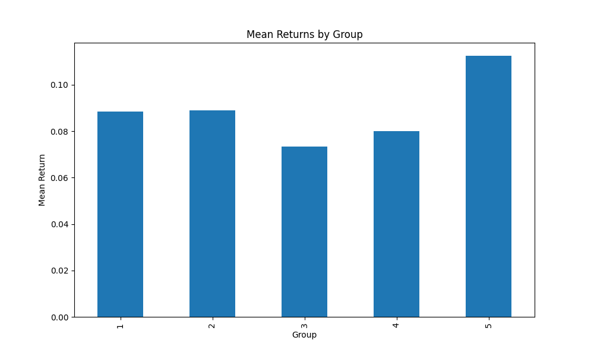
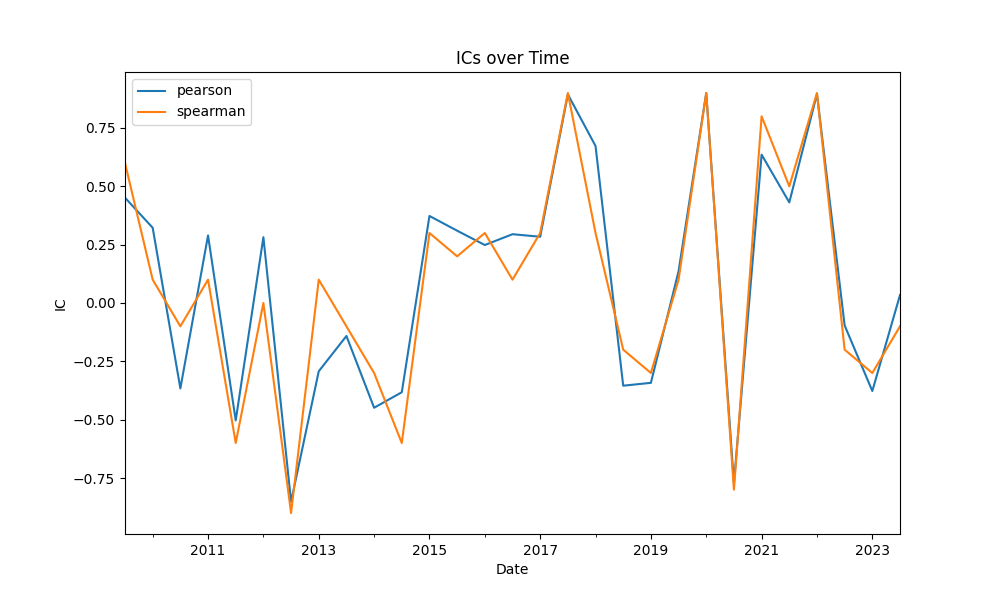
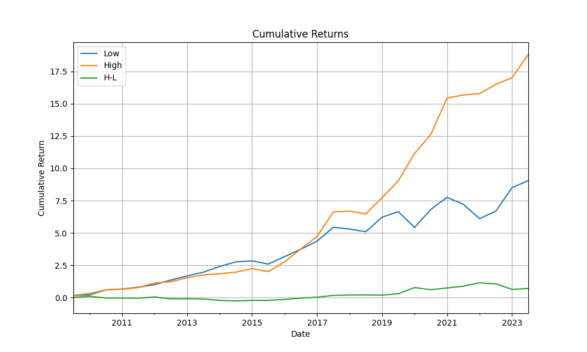
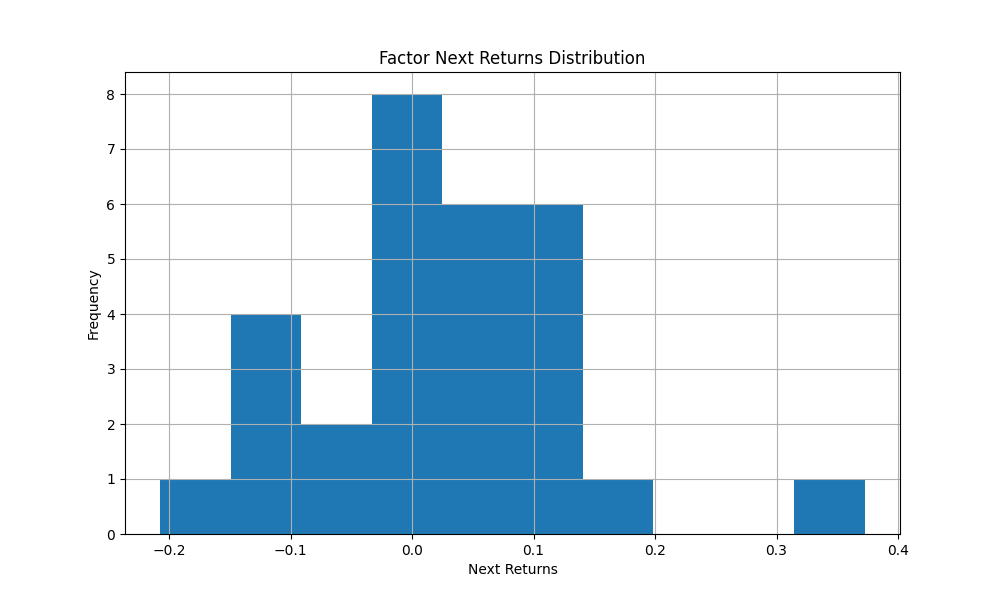
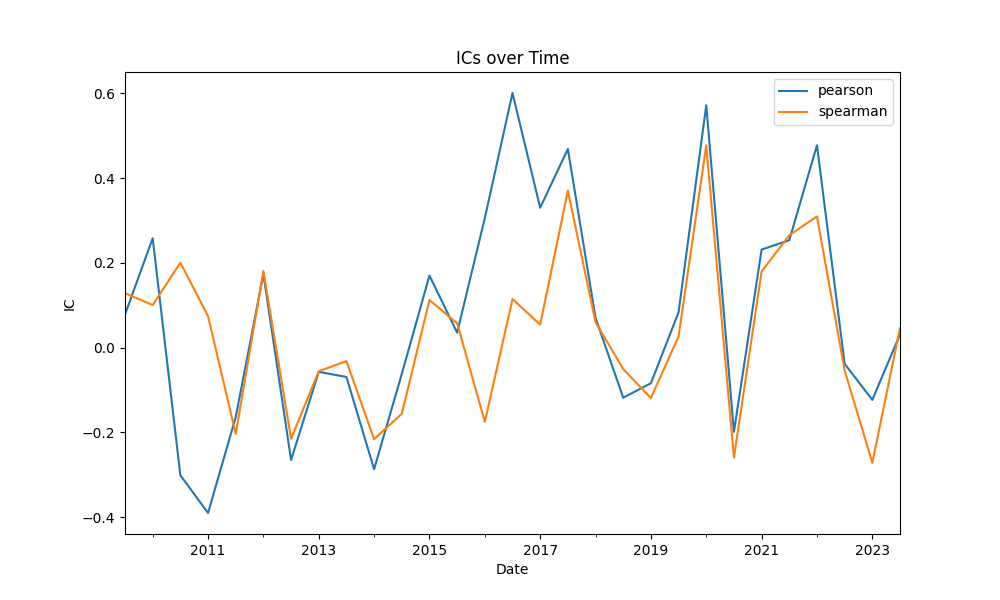
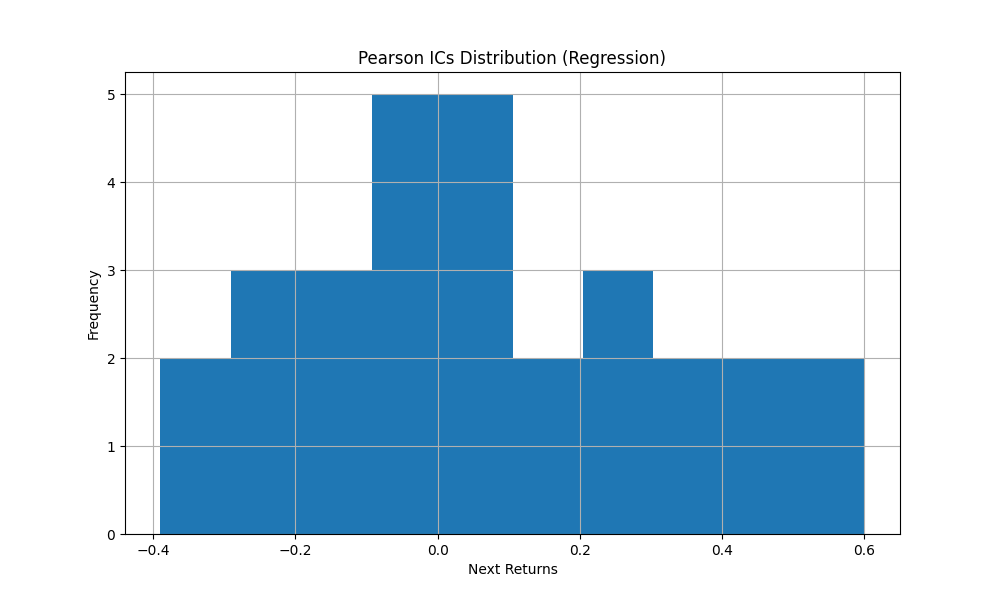
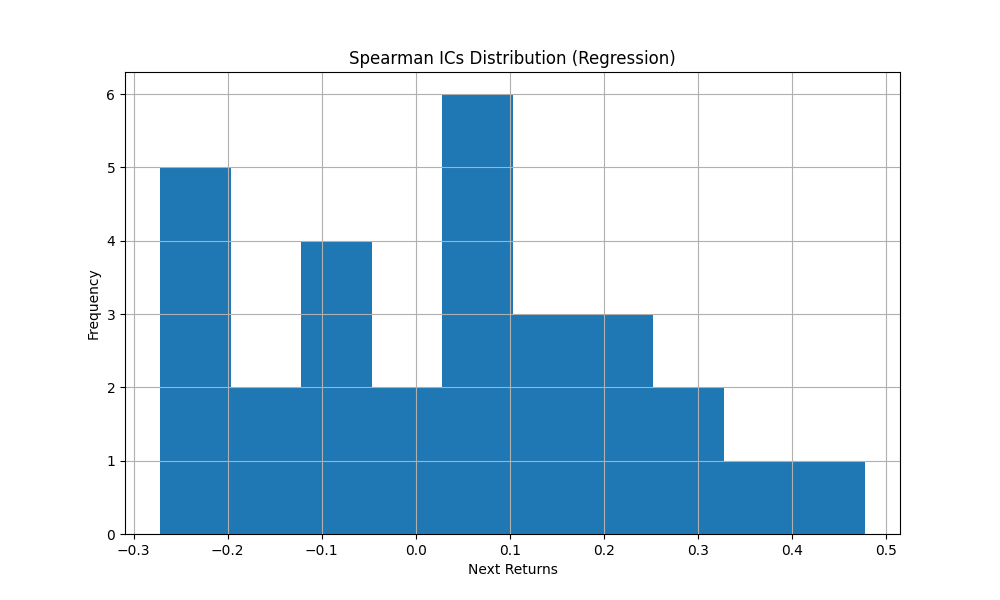
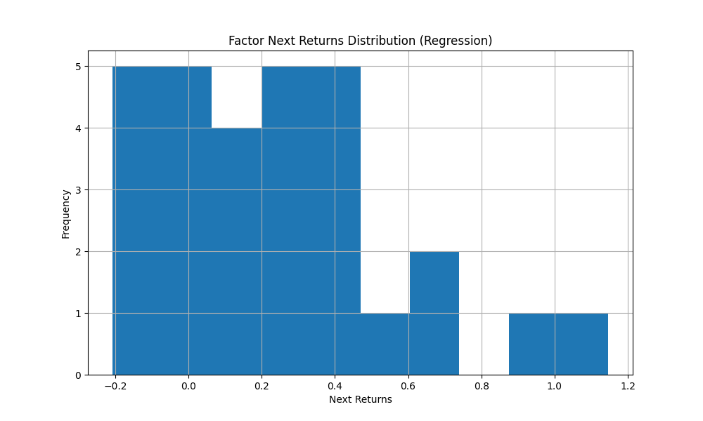

# UnitTestFactor Evaluation Results

Description: UnitTest Description

## Highlight

| Method     |   Factor Mean |   Factor Std |   IC (mean) |   ICIR |
|:-----------|--------------:|-------------:|------------:|-------:|
| Sort       |       0.02398 |       0.1093 |     0.07804 | 0.1602 |
| Regression |       0.2484  |       0.3294 |     0.05047 | 0.2206 |

**Interpretation:**  

- IC > 0.15: strong predictive power
- ICIR > 0.5: good consistency
- ICIR > 1.0: very strong and stable factor.

## FactorSort Evaluation

### Group Statistics

|     |   n_t |      mean |       std |   t_stat |     p_value |
|:----|------:|----------:|----------:|---------:|------------:|
| 1   |    29 | 0.0885481 | 0.111375  |  4.28144 | 0.000196754 |
| 2   |    29 | 0.0891001 | 0.0796305 |  6.02557 | 1.70847e-06 |
| 3   |    29 | 0.0733806 | 0.0827146 |  4.77747 | 5.09591e-05 |
| 4   |    29 | 0.0801611 | 0.0831504 |  5.19157 | 1.64283e-05 |
| 5   |    29 | 0.11253   | 0.0973799 |  6.22296 | 1.00657e-06 |
| H-L |    29 | 0.0239817 | 0.109278  |  1.18181 | 0.247222    |

### ICs and ICIR

|       |    pearson |   spearman |
|:------|-----------:|-----------:|
| count | 29         | 29         |
| mean  |  0.0871048 |  0.0689655 |
| std   |  0.490829  |  0.483369  |
| min   | -0.851282  | -0.9       |
| 25%   | -0.35441   | -0.2       |
| 50%   |  0.248473  |  0.1       |
| 75%   |  0.373013  |  0.3       |
| max   |  0.899844  |  0.9       |

ICIR Table:

|          |   ICs mean |      std |     ICIR |
|:---------|-----------:|---------:|---------:|
| pearson  |  0.0871048 | 0.490829 | 0.177465 |
| spearman |  0.0689655 | 0.483369 | 0.142677 |

### Accumulated Returns

| date                |     Low |    High |      H-L |
|:--------------------|--------:|--------:|---------:|
| 2021-07-31 00:00:00 | 7.21783 | 15.679  | 0.877762 |
| 2022-01-31 00:00:00 | 6.10688 | 15.7872 | 1.1438   |
| 2022-07-31 00:00:00 | 6.6856  | 16.4996 | 1.06019  |
| 2023-01-31 00:00:00 | 8.50623 | 17.018  | 0.63319  |
| 2023-07-31 00:00:00 | 9.05501 | 18.8056 | 0.700941 |

### Histogram of Factor Returns

## FactorRegression Evaluation

### ICs and ICIR for Regression Method

|        |    pearson |   spearman |
|:-------|-----------:|-----------:|
| count  | 29         |  29        |
| unique | 29         |  29        |
| top    |  0.0780523 |   0.128365 |
| freq   |  1         |   1        |

ICIR Table:

|          |   ICs mean |      std |     ICIR |
|:---------|-----------:|---------:|---------:|
| pearson  |  0.0682452 | 0.265724 | 0.256827 |
| spearman |  0.0326877 | 0.191769 | 0.170453 |

### ICs Histogram (Pearson)

### ICs Histogram (Spearman)

### t-test for factor_next_returns

T-statistic: 4.0619, p-value: 0.0003558

### Histogram of Factor Returns (Regression)

